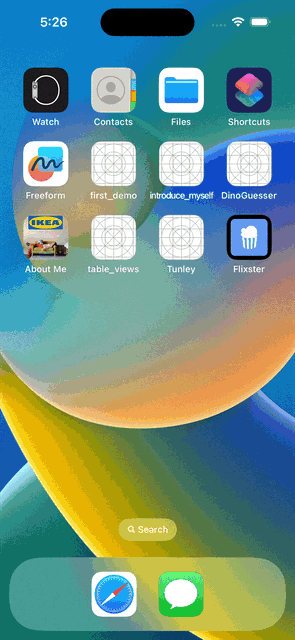

# Project 3 - *Flixster*

Submitted by: **Leonardo Villalobos**

**Flixster** is an app that uses the MovieDB API to load movie data for movies that are currently showing.

Time spent: **4** hours spent in total

## Required Features

The following **required** functionality is completed:
- [X] Implement network call and table view to display a list of movies currently playing (title, description, image)
- [X] App has a collection view with the same list of movies
- [X] Uses a tab bar controller to switch between collection view and table view screens
 
The following **optional** features are implemented:
- [ ] Make an additional network call to another end-point.	
- [X] Allow users to scroll when context items are off-screen (table view implemention)

## Video Walkthrough
Here's a walkthrough of implemented user stories:

## License

    Copyright 2023 Leonardo Villalobos

    Licensed under the Apache License, Version 2.0 (the "License");
    you may not use this file except in compliance with the License.
    You may obtain a copy of the License at

        http://www.apache.org/licenses/LICENSE-2.0

    Unless required by applicable law or agreed to in writing, software
    distributed under the License is distributed on an "AS IS" BASIS,
    WITHOUT WARRANTIES OR CONDITIONS OF ANY KIND, either express or implied.
    See the License for the specific language governing permissions and
    limitations under the License.
